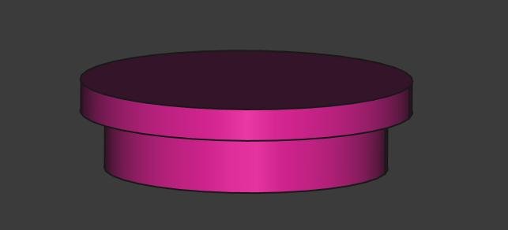

## 3D files for printing

#### The Candy dispenser is a simple 3D model that can be printed using a 3D printer.

### Candy structure
The candy assembles with 6 parts:
1. The base
2. The electronics component
3. The rotating cylinder
4. The N20 Geared DC motor support
5. The candy jar
6. the candy jar cap

#### The Base

#### The electronics component

#### The rotating cylinder

#### The N20 Geared DC Motor support

#### The Candy Jar

#### The Candy Jar Cap

