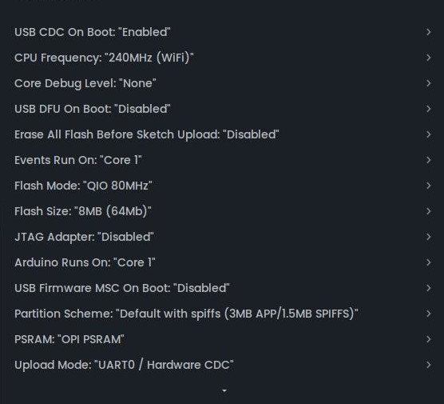

## Arduino Sketch and auxiliary files
### Uploading Code to the Seeed Studio Xiao ESP32S3 Sense

To run the Candy Machine on the Xiao ESP32S3 Sense, with microphone and the LCD (Xiao round display for XIAO), we need to configure the Arduino IDE development environment properly.

### ✅ Requirements

- Arduino IDE installed
- ESP32-S3 board added via **Boards Manager** (Espressif)
- Official `ESP32` library (v2.0.7 or higher recommended)

### Libraries
- `TFT_eSPI`
- `ArduinoJSON`
- `PNGdec`
- `Wire`

#### Custom libraries
- `CHSC6X_Touch.h` **( Xiao Round Display Touch screen)**
- `cookie.h`       **(cookie image)**
- `no_cookies.h`   **(no cookie image)**

---

### ⚙️ Required Settings in Arduino IDE

Set these under **Tools**:

- **USB CDC On Boot**: ✔️ Enabled
- **PSRAM**: ✔️ Enabled ✅ required for audio/transcription
- **Flash Size**: 16MB
- **Partition Scheme**: "Default 4MB with spiffs" or larger

