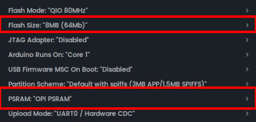

## :electric_plug: Multitasking with FreeRTOS on the ESP32-S3

We use the power of the ESP32-S3's dual-core architecture and the built-in FreeRTOS real-time operating system to run multiple tasks simultaneously.

We use parallel tasks (xTaskCreatePinnedToCore) to separate the application's logic into well-defined states.

### :dart: Main tasks:
```
    standbyTask: breathing animation while waiting for touch interaction.

    gravacaoTask: audio recording using the PDM microphone.

    sendTask: HTTP POST to the API and spinning loader animation.

    recordingVisualTask: animated ripple effect during recording.

    cookieTask: cookie animation + motor control to dispense the treat.

    noCookieTask: visual feedback when no cookie is dispensed.
```

### 🧩 Task coordination:
```
    We define clear application states (AppState) to represent each phase of operation.

    A binary semaphore (semState) is used to signal and switch between tasks safely.

    Some tasks use flags (e.g., recordingVisualShouldStop) to exit gracefully and keep transitions visually coherent.
```

### ⚙️ Performance on XIAO ESP32-S3

Despite its tiny form factor, the XIAO ESP32-S3 handles everything — from Wi-Fi connectivity and I2S audio capture to real-time sprite rendering on the TFT display — all thanks to the robust multitasking provided by FreeRTOS.

### Uploading Code to the Seeed Studio Xiao ESP32S3 Sense

To run the Candy Machine on the Xiao ESP32S3 Sense, with microphone and the LCD (Xiao round display for XIAO), we need to configure the Arduino IDE development environment properly.

### ✅ Requirements

- Arduino IDE installed
- ESP32-S3 board added via **Boards Manager** (Espressif)
- Official `ESP32` library (v2.0.7 or higher recommended)

### Libraries
- `TFT_eSPI`
- `ArduinoJSON`
- `PNGdec`
- `Wire`

#### Custom libraries (included in the repository)
- `CHSC6X_Touch.h` **( Xiao Round Display Touch screen)**
- `cookie.h`       **(cookie image)**
- `no_cookies.h`   **(no cookie image)**
---


Under  [files](./files) directory you'll find all the needed files for the client. 


### ⚙️ Required Settings in Arduino IDE

Set these under **Tools**:

- **PSRAM**: ✔️ Enabled ✅ required for audio/transcription
- **Flash Size:**: "8MB (64Mb)"



## ⚠️ Warning
You can't change much regarding Xiao Pins. Some are used by the Sense, byt the Round Display, I2C, etc.
There aren't many available. 

You can read more about it on Seeedstudio Wiki
[https://wiki.seeedstudio.com/xiao_esp32s3_pin_multiplexing/](https://wiki.seeedstudio.com/xiao_esp32s3_pin_multiplexing/)
[https://wiki.seeedstudio.com/xiao_esp32s3_getting_started/](https://wiki.seeedstudio.com/xiao_esp32s3_getting_started/)


## :hammer: Options to change
You need to change some variables in the code. 

### WiFi Network

```c
// Change here your wifi password and network
const char* ssid = "<your_wifi_ssid>";
const char* password = "<your_wifi_network_passsword>";

// change here the IP of the server - change change the IP address, nothing else
const char* apiUrl = "http://<your_server_IP>:8000/analyze-audio"; 
```

### :record_button: Recording
By default, we record a 5 seconds phrase. If you want to record more or less, you need to change the following variable
```c
// Time in seconds to record
#define RECORD_TIME 5
```
Change the 5 for the number of seconds you want to record. 

### Motor rotation
By default, and after some testing for this motor, 1s is enough for a full rotation. If your motor takes longer or less to a full rotation (to make sure a candy exits), you need to adjust the following variable, that resides in the **cookieTask** function. The value is in miliseconds. 
```c
const unsigned long duration = 1000; // how long the motor turns
```

## :framed_picture: Images
The displayed images are C flash arrays.

The instructions are inside the TFT_eSPI examples, Flash_PNG sketch. 
```
// Image files can be converted to arrays using the tool here:
// https://notisrac.github.io/FileToCArray/
// To use this tool:
//   1. Drag and drop file on "Browse..." button
//   2. Tick box "Treat as binary"
//   3. Click "Convert"
//   4. Click "Save as file" and move the header file to sketch folder
//   5. Open the sketch in IDE
//   6. Include the header file containing the array 
```
We have *cookie.h* and *no_cookies.h* files, that are C Flash Arrays . 

## Code explanation
There are several functions along the code that require some in depth explain. 

### Tasks

We're defining here the several tasks that we're going to go through as FreeRTOS tasks. This is necessary for the multitasking that we're going to be using - showing animations while performing several other functions on the background. 

```c
SemaphoreHandle_t semState = NULL;
TaskHandle_t taskHandles[6]; // standby, gravacao, send, cookies, noCookies, recordingVisual
```


### void sendTask(void* param)
This function will send the recording to the server using HTTP Post method. 
```c
WiFiClient client;
HTTPClient http;
http.begin(client, apiUrl);
http.addHeader("Content-Type", "audio/wav");
int code = http.POST(wav_buffer, wav_size);
```
It then displays an animation while waiting
```c
 // animation
    for (int f = 0; f < 150; f++) {
      sprite.fillSprite(TFT_BLACK);
      for (int i = 0; i < numBars; i++) {
        float angle = (frame * 4 + i * angleStep) * DEG_TO_RAD;
        float x = 120 + cos(angle) * radius;
        float y = 120 + sin(angle) * radius;
        float glowFactor = (sin((frame * 0.15) + i) + 1.0) / 2.0;
        float coreAlpha = 0.4 + 0.6 * glowFactor;
        float outerAlpha = 0.2 * glowFactor;
        uint16_t coreColor = dimColor(baseColor, coreAlpha);
        uint16_t glowColor = dimColor(baseColor, outerAlpha);
        sprite.fillRoundRect(x - barWidth / 2, y - barLength / 2, barWidth, barLength, 2, glowColor);
        sprite.fillRoundRect(x - barWidth / 2, y - barLength / 2, barWidth, barLength, 2, coreColor);
      }
      sprite.pushSprite(0, 0);
      frame++;
      vTaskDelay(pdMS_TO_TICKS(20));
    }
```
Because we're using FreeRTOS tasks, we can't use **delay**, but instead we use **vTaskDelay(pdMS_TO_TICKS)**, where it converts the ticks to milliseconds. 

When the resulting code arrives, we check it. If it's greater than 0, we proceded to check the returning JSON payload. 

If it's *positivo* (positive), we change the state to **COOKIE** (we're going to dispense a cookie). If not, the state is changed to **NO_COOKIE** and no cookie will be given .

```c
if (code > 0) {
      String payload = http.getString();
      StaticJsonDocument<256> doc;
      if (!deserializeJson(doc, payload)) {
        bool positivo = doc["positivo"];
        changeState(positivo ? COOKIE : NO_COOKIE);
      } else changeState(NO_COOKIE);
    } else changeState(NO_COOKIE);

    http.end();
  }
```

### void gravacaoTask(void* param)
This is the function that will record the 5s phrase. We're in loop (athough not necessary) because FreeRTOS requires it for the tasks. But it doesn't interferes because the task is suspended after the recording. 

If the current state is not recording, we stop it right here. 
```c
if (currentState != RECORDING) vTaskSuspend(NULL);
```

We start by declaring the I2SClass varible to record the audio. We set the PINs (by Xiao ESP32S3 documentation), set the environment of the recoring and start recording. 

```c
 I2SClass i2s;
    i2s.setPinsPdmRx(42, 41);
    i2s.begin(I2S_MODE_PDM_RX, 16000, I2S_DATA_BIT_WIDTH_16BIT, I2S_SLOT_MODE_MONO);
    uint8_t* buf = i2s.recordWAV(RECORD_TIME, &wav_size);
```
After the recording, we copy the buffer to another buffer **
```c
memcpy(wav_buffer, buf, wav_size);
```
We then free the buffer. 
```c
free(buf);
```

Unlike all the other tasks, we here set a global variable as true for the recording animation to stop. 
```c
recordingVisualShouldStop = true;
```
This task was suspending another task (**recordingVisualTask**) without having the assurance that was ocurring on the same core. 

⚠️  **Classical error on FreeRTOS**

"One task must not suspend another task that's potencially running on another core". 

And that was the case. 
By replacing the **vTaskSuspend** with a signal for it to self-suspend, all the problems went away. 

Here's the code on the **recordingVisualTask** function that checks for the signal:
```c
 if (currentState != RECORDING || recordingVisualShouldStop) {
      recordingVisualShouldStop = false;  // clears the flag
      vTaskSuspend(NULL);
    }
```

I must thank **ChatGPT** for this. It was able to spot the problem and provide a solution for it. 

After copying the buffer, we change the state to **SENDING**


### void changeState(AppState newState)
This is the function responsable for changing the states and using the FreeRTOS semaphores for synchronization between tasks.
```c
  currentState = newState;

  xSemaphoreGive(semState);
  switch (newState) {
    case STANDBY:    vTaskResume(taskHandles[0]); break;
    case RECORDING:
      vTaskResume(taskHandles[1]);
      vTaskResume(taskHandles[5]);
      break;
    case SENDING:    vTaskResume(taskHandles[2]); break;
    case COOKIE:     vTaskResume(taskHandles[3]); break;
    case NO_COOKIE:  vTaskResume(taskHandles[4]); break;
  }
}
```

The taks are a **enum** type
```c
enum AppState {
  STANDBY,
  RECORDING,
  SENDING,
  COOKIE,
  NO_COOKIE
} currentState = STANDBY;
```

In the begining of the file, we define a TaskHandle_t array big enough of the several tasks. 

```c
SemaphoreHandle_t semState = NULL;
TaskHandle_t taskHandles[6]; // standby, gravacao, send, cookies, noCookies, recordingVisual
```
We have 6 tasks, and, instead of defining 6 TaskHandle_t variables, just the one. 

On the **setup()** function, we define the semaphores:
```c
  semState = xSemaphoreCreateBinary();
  xTaskCreatePinnedToCore(standbyTask, "standby", 4096, NULL, 1, &taskHandles[0], 0);
  xTaskCreatePinnedToCore(gravacaoTask, "gravacao", 4096, NULL, 1, &taskHandles[1], 0);
  xTaskCreatePinnedToCore(sendTask, "send", 4096, NULL, 1, &taskHandles[2], 0);
  xTaskCreatePinnedToCore(cookieTask, "cookie", 2048, NULL, 1, &taskHandles[3], 0);
  xTaskCreatePinnedToCore(noCookieTask, "nocookie", 2048, NULL, 1, &taskHandles[4], 0);
  xTaskCreatePinnedToCore(recordingVisualTask, "recordVis", 2048, NULL, 1, &taskHandles[5], 0);
```

You can check more about them here:

[https://www.freertos.org/Documentation/02-Kernel/02-Kernel-features/01-Tasks-and-co-routines/00-Tasks-and-co-routines](https://www.freertos.org/Documentation/02-Kernel/02-Kernel-features/01-Tasks-and-co-routines/00-Tasks-and-co-routines)

