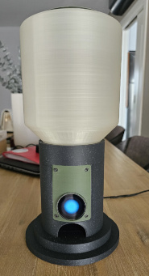
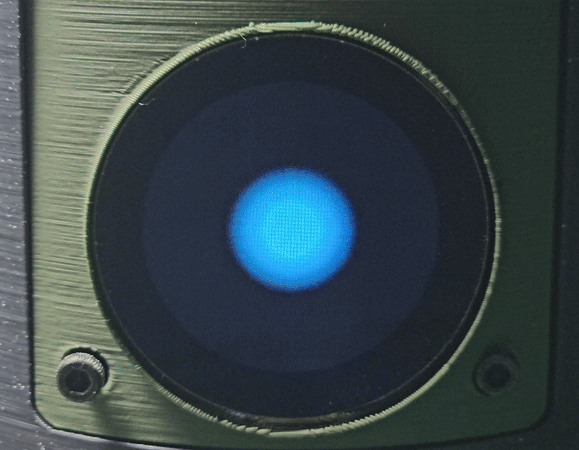
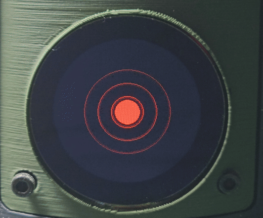
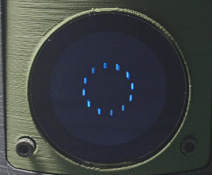
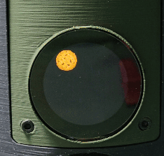
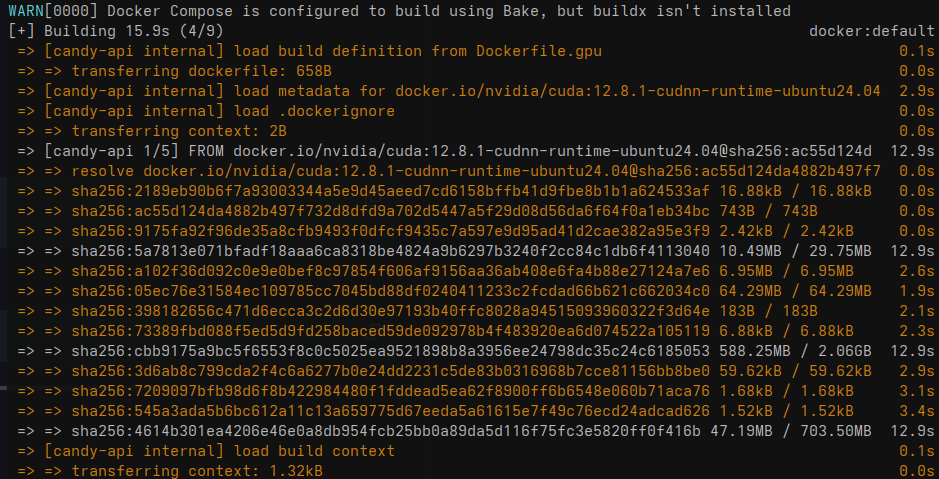
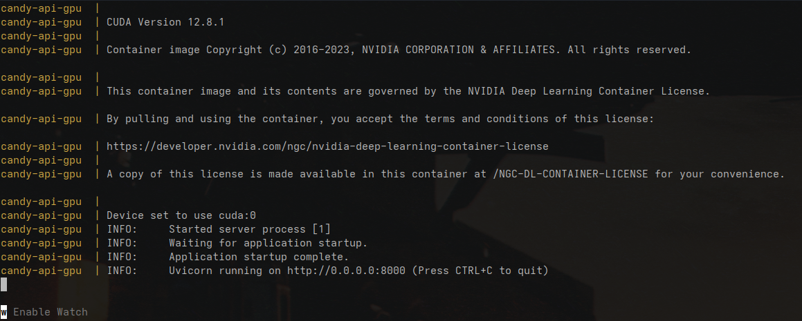

# Candy Machine with Voice Recognition
<div style="text-align: center;">
    
</div>

This project is a tiny, AI-powered candy dispenser built with the Seeed Studio ESP32S3 Sense and the Xiao Round Display for XIAO.

Say the right magic words, and you’ll be rewarded with a cookie. 😄
If not, the screen politely tells you to try again.

---

## 📷 How It Works
1. When starting, the standy screen is shown



2. The user presses the display.
3. The Xiao starts recording a phrase for **5 seconds**.



4. The phrase is sent to a **remote server**:
   - Automatically transcribes the audio using **Whisper** (OpenAI)
   - Classifies the phrase as **positive** or **negative** about chocolate or candy

5. While waitinng for a response from the server



4. If the phrase is **positive**:


   - A candy is automatically **dispensed**

5. Otherwise, a image is shown asking the user to try again.


---

Project Structure

```
.
├── 3D/                       # Directory for the 3D models
├── Arduino/                  # Directory for the Arduino code
├── main.py                   # API code
├── Dockerfile                # Dockerfile for CPU
├── Dockerfile.gpu            # Dockerfile with CUDA support (GPU)
├── docker-compose.cpu.yml    # Compose file for CPU use
├── docker-compose.gpu.yml    # Compose file for GPU (NVIDIA)
```

---

## 📷 How to Use
## Server
### Deployment with Docker Compose
### ⚙️ Requirements

- Docker 20.10+
- `docker compose` (modern CLI)
- For GPU use:
  - NVIDIA drivers installed
  - `nvidia-container-toolkit`: [official guide](https://docs.nvidia.com/datacenter/cloud-native/container-toolkit/install-guide.html)

---

### 🖥️ Using with GPU (CUDA), building the image

Uses GPU to accelerate transcription and classification.

#### ✅ Requirements:

- NVIDIA GPU compatible with CUDA 11.8+
- Drivers installed (`nvidia-smi` should work)
- Docker with NVIDIA runtime
- Install the toolkit:
```bash
sudo apt-get install -y nvidia-container-toolkit
sudo systemctl restart docker
```

#### ▶️ Command:

```bash
docker compose -f docker-compose.gpu.yml up --build
```
After the command, it should start buiding the machine. 



---

### 🖥️ Using with CPU only, building the image

Simpler and portable; good for testing and light deployments.

#### ▶️ Command:

```bash
docker compose -f docker-compose.cpu.yml up --build
```

---

## ⚙️ Testing GPU (CUDA) Support

### ✅ 1. Check NVIDIA drivers
```bash
nvidia-smi
```

### ✅ 2. Install `nvidia-container-toolkit` (apt package)
```bash
sudo apt install nvidia-container-toolkit
sudo systemctl restart docker
```

### ✅ 3. Verify GPU access via Docker
```bash
docker run --rm --gpus all nvidia/cuda:11.8.0-base nvidia-smi
```

### ▶️ 4. Start with GPU (after building the image, above instructions)
```bash
docker compose -f docker-compose.gpu.yml up
```
After a bit, the container is ready and listening. 


### 5. Check if PyTorch uses CUDA
```bash
docker exec -it candy-api-gpu python3 -c "import torch; print(torch.cuda.is_available())"
```
---

## 📦 Models Used
These are the models used. You can change them in `main.py`.

- [`openai/whisper-small`](https://github.com/openai/whisper): for audio transcription
- [`facebook/bart-large-mnli`](https://huggingface.co/facebook/bart-large-mnli): for zero-shot classification

---

## Customization

- You can change the classification **labels** (`positive`, `negative`) in `main.py`
- You can switch Whisper models to `tiny`, `base`, or `large` depending on your hardware
- You can switch the language used by model for the transcription (`pt`, `en`, `es`, etc.)

### Everything is customizable

Instead of something about candy, it can be about anything. The Xiao records a 5 seconds phrase (customizable, but be aware of memory limitations - it's recorded on memory) and sends it to the server for transcription by whisper. There, you can **change** the classification labels and make it about anything. 

## 🔧 Auto-start on Boot (systemd)
For the docker image to start at boot, we need to create a Systemd file. 
Let's create the file
```bash
sudo vi /etc/systemd/system/candy-machine.service
```
Inside, place the following lines. **Here I'm using the docker compose GPU file**.

Don't forget to replace the location for your working directory, where the docker compose files are located. 

```
[Unit]
Description=Candy Machine API (Docker Compose)
Requires=docker.service
After=docker.service

[Service]
Type=oneshot
RemainAfterExit=yes
WorkingDirectory=/path/for/the/project
ExecStart=/usr/bin/docker compose -f docker-compose.cpu.yml up -d
ExecStop=/usr/bin/docker compose -f docker-compose.cpu.yml down
TimeoutStartSec=0

[Install]
WantedBy=multi-user.target
```
Reload Systemd and enable the new service.

```bash
sudo systemctl daemon-reexec
sudo systemctl daemon-reload
sudo systemctl enable candy-machine.service
```

Start it manually the first time.
```bash
sudo systemctl start candy-machine.service
```
Now, the Candy Machine will start automatically when the system starts. 

## Client (the candy dispenser)
### 3D Files
Go to the [3D](./3D/readme.md) folder for more information.

### Schematics
Go to the [Schematics](./Schematics/readme.md) folder for more information on how to wire the project. 

### Arduino Code
Go to the [Arduino](./Arduino/readme.md) folder for more information.

## 🔧 TODO
- [ ] :bulb: Add a sensor to detect motor rotation (make sure a candy exits)
- [ ] 🧠 Migrate the FastAPI server to work with a Raspbery PI AI Hat+ 


## License
This project is free software: you can redistribute it and/or modify  
it under the terms of the [GNU General Public License](https://www.gnu.org/licenses/gpl-3.0.en.html)  
as published by the Free Software Foundation, either version 3 of the License,  
or (at your option) any later version.

This project is distributed in the hope that it will be useful,  
but WITHOUT ANY WARRANTY; without even the implied warranty of  
MERCHANTABILITY or FITNESS FOR A PARTICULAR PURPOSE. See the GNU General Public License for more details.

