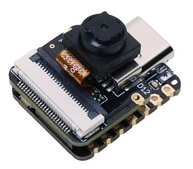
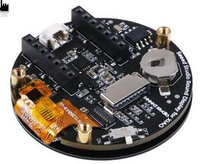
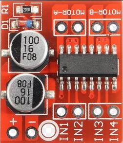
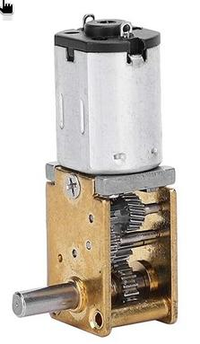
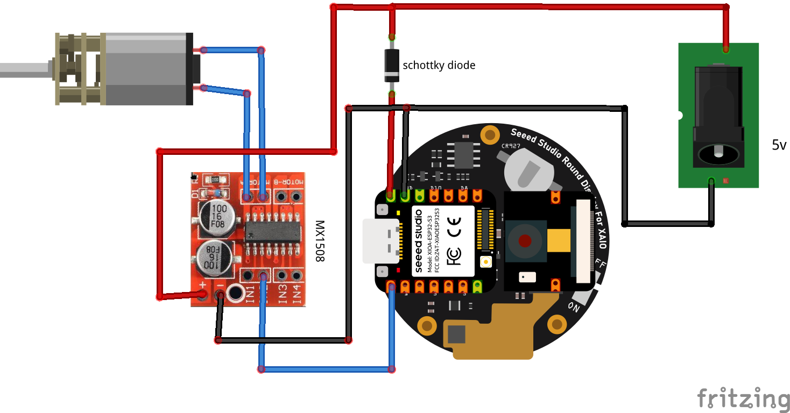

## Schematics for the Candy Machine

Here are the schematics for the Candy Machine electronics component. 

You'll need:
- Seeedstudio ESP32S3 Sense (you must remove the camera)

- Seeedstudio Round display for Xiao

- MX1508 motor shied

- DC 6V Mini Gear Motor right angle

## Schematics

