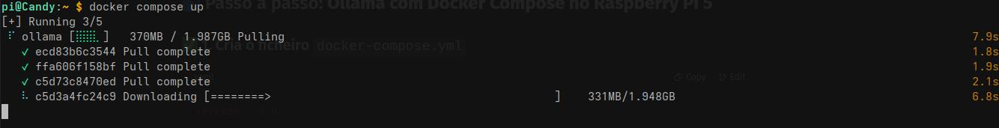
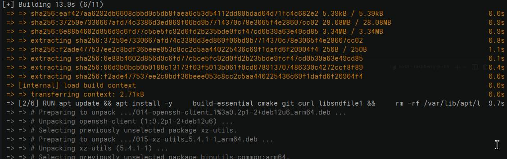
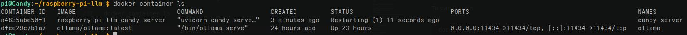

# Using Raspberry PI has the server
We can also use a Rasbpberry PI 5 has a server for the Candy Machine. 
We need a PI5 because we need to use a LLM for the transcription and analysis.

We're going to use Ollama for the language model and Whisper.cpp for the audio transcription.

## Project structure
Here's the project structure to use the Raspberry PI has the server for the Candy Dispenser
```

raspberry-pi-llm/
├── docker-compose.yml
├── server/
│   ├── Dockerfile
│   ├── server.py
│   ├── .env
│   └── whisper.cpp/         # included in the container
```
### Files
#### 📄 .env
```bash
OLLAMA_URL=http://localhost:11434
WHISPER_MODEL=./whisper.cpp/models/ggml-base.en.bin
```
#### 📄 docker-compose.yml
```
services:
  ollama:
    image: ollama/ollama:latest
    container_name: ollama
    restart: unless-stopped
    ports:
      - "11434:11434"
    volumes:
      - ollama_data:/root/.ollama

volumes:
  ollama_data:
```

#### 📄 candy-server.py
```python
from fastapi import FastAPI, UploadFile
from fastapi.responses import JSONResponse
import uvicorn
import subprocess
import tempfile
import os
import requests
from dotenv import load_dotenv

load_dotenv()

OLLAMA_URL = os.getenv("OLLAMA_URL", "http://localhost:11434")
WHISPER_MODEL = os.getenv("WHISPER_MODEL", "./whisper.cpp/models/ggml-base.en.bin")

app = FastAPI()

@app.post("/audio")
async def receive_audio(file: UploadFile):
    # Guarda o áudio recebido temporariamente
    with tempfile.NamedTemporaryFile(delete=False, suffix=".wav") as tmp:
        tmp.write(await file.read())
        wav_path = tmp.name

    # Executa whisper.cpp
    result = subprocess.run([
        "./whisper.cpp/main",
        "-m", WHISPER_MODEL,
        "-f", wav_path,
        "-otxt"
    ])

    txt_path = wav_path.replace(".wav", ".txt")
    if not os.path.exists(txt_path):
        return JSONResponse(status_code=500, content={"error": "Erro na transcrição"})

    with open(txt_path, 'r') as f:
        transcription = f.read().strip()

    os.remove(wav_path)
    os.remove(txt_path)

    # Prepara prompt
    prompt = f'A criança disse: "{transcription}". Esta frase está relacionada com doces? Responde apenas com SIM ou NÃO.'

    try:
        response = requests.post(f"{OLLAMA_URL}/api/generate", json={
            "model": "phi3:mini",
            "prompt": prompt,
            "stream": False
        })

        resposta = response.json()["response"].strip().upper()
        is_positive = "SIM" in resposta

    except Exception as e:
        return JSONResponse(status_code=500, content={"error": f"Erro no modelo: {str(e)}"})

    return JSONResponse(content={
        "positivo": is_positive,
        "text": transcription
    })

if __name__ == "__main__":
    uvicorn.run("server:app", host="0.0.0.0", port=5000)
```

## Docker
Like with the reComputer, let's use docker with Ollama for a better handling and cleaner approach. 

### Install docker
You can find the instructions on the following link: [https://docs.docker.com/engine/install/debian/](https://docs.docker.com/engine/install/debian/)

Docker documentation recommends using the Debian instructions for the 64bit version of Raspbian. 

If you're using the 32bits version, you can follow these instructions: [https://docs.docker.com/engine/install/raspberry-pi-os/](https://docs.docker.com/engine/install/raspberry-pi-os/)

Add pi user (or the user you're using) to the docker group so we use docker as a normal user
```bash
sudo gpasswd -a pi docker
```

Logout and login again
## Clone the repository
How to clone this

## Server build
Our fina goal will be:
| Service      | Function                                | Execution                 |
| ------------ | ------------------------------------- | --------------------------------- |
| `ollama`     | LLM via API REST                      | Isolated Container
| `Candy-server` | FastAPI + Whisper.cpp + application logic | Container that builds  whisper.cpp |

This will be two containers. One running ollama and the other one running our server, that will use Ollama API. 

### Pull and run Ollama docker
```bash
docker compose up -d
```
The Ollama image should start being pulled


After a while, you should have the image created. Let's see if it's running:
```bash
curl http://localhost:11434
```
And the result should be:
```
Ollama is running
```
#### Pull the desired model
We can use any model we want, as long it does what we need. Here's an example of a possible prompt:
```
The children said: "I want a cookie". 
Is this phrase candy related?
It answers with Positive or Negative.
```
This are possible models that we can use:
- llama3:instruct
- mistral:instruct
- phi3:mini

Let's use phi3:mini.

Pull the model (Ollama must be running). We can use the API that Ollama exposes, on port 11434, or the CLI.
```bash
curl http://localhost:11434/api/pull -d '{"name": "phi3:mini"}'
```
After a while, a success message should appear. 

## Docker image for the server
Let's now create a docker image, using docker container, for our server to run. This way, we don't have to create a Virtual Environment and it will keep all clean. 


### Whisper.cpp
We're going to use Whisper.cpp for the transcription. Our docker image wil take care of that. 

#### The model. 
You can read more about Whisper.cpp models here:

[https://github.com/ggml-org/whisper.cpp/blob/master/models/README.md](https://github.com/ggml-org/whisper.cpp/blob/master/models/README.md)


By default, in the .env file, the model used is a multilingue model, sso it can understand Portuguese. 

If you need a different model, let's say for the English language, change it in the [Dockerfile](./server/Dockerfile) inside the server directory. 

Locate the following section inside the file:
```
# Clones and compiles whisper.cpp inside the container
RUN git clone https://github.com/ggerganov/whisper.cpp && \
    cd whisper.cpp && make -j && \
    ./models/download-ggml-model.sh small
```
In this line `./models/download-ggml-model.sh small`, change `small`for the desired model, like `base.en`

Read the documentation for mode options.

Now, we need to change the **.env** file to use this new model.
```bash
vi .env
```
change

`WHISPER_MODEL=./whisper.cpp/models/ggml-small.bin`

to:

`WHISPER_MODEL=./whisper.cpp/models/ggml-base.en.bin`

### Build the image
To build the image, let's use docker compose.
```bash
cd raspberry-pi-llm
docker compose up --build -d
```
It should start building the image, that will include compilling Whisper.cpp



After a while, the image is build and the container is run .

To stop the container, just run, inside the raspberry-pi-llm (where the docker-compose.yml is):
```
docker compose stop

[+] Stopping 1/1
 ✔ Container candy-server  Stopped
 ```
To start it again
```
docker compose start
[+] Running 1/1
 ✔ Container candy-server  Started 
```

To see all the containers running:
```
docker container ls
```


